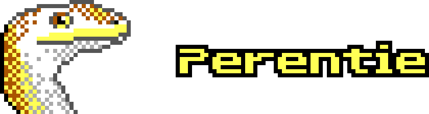

Perentie is a Lua-based graphical adventure game engine. The design is heavily inspired by LucasArts' SCUMM and GrimE adventure game engines.

Perentie is designed for the hardware constraints of Pentium-era MS-DOS. You can run it in any of the following environments:

- MS-DOS, including as a child process from inside Windows 3.1/95/98
- Natively on most platforms (via SDL3)
- Embedded in a webpage (via SDL3 + Emscripten)

Featuring:

- Lua-based scripting API
- Co-operative threading
- 320x200 resolution 256 colour VGA graphics
- Programmable dithering engine (convert your graphics to EGA and CGA!)
- Bitmap text rendering with support for UTF-8
- PC speaker tone/sample playback
- OPL2/OPL3 music playback
- Debug shell over null modem/Telnet connection

Perentie was originally created for DOS Games Jam July 2024.

Download
========

You can obtain the latest version from the `releases page <https://github.com/moralrecordings/perentie/releases>`_.

Documentation
=============

For general information about engine concepts, check out the `Perentie guide <https://moral.net.au/perentie/guide/>`_.

For information about the Perentie Lua scripting API, check out the `Perentie API docs <https://moral.net.au/perentie/doc/>`_.

Please check out the example game, `Maura and Ash <https://moralrecordings.itch.io/mauraash>`_, along with the `full source code <https://github.com/moralrecordings/mauraash>`_

Compiling
=========

In order to build Perentie, you will need the following tools in your PATH:

- `Meson <https://mesonbuild.com>`_
- `Ninja <https://ninja-build.org>`_
- `lua and luac <https://www.lua.org>`_, version 5.4

MS-DOS executable
-----------------

You will also need:

- A copy of the DJGPP cross-compiler toolchain. You can build one using the scripts from https://github.com/andrewwutw/build-djgpp

.. code-block:: bash

   source /path/to/djgpp/setenv
   meson setup --cross-file=i586-pc-msdosdjgpp.ini build_dos
   cd build_dos
   ninja

If you're building with `-Dbuildtype=release`, you will need to also include `--optimization=2`. The default is to use -O3, which with DJGPP will cause aggressive inlining of functions. This will cause a lot of mystery crashes in PhysicsFS.

SDL executable
--------------

You will also need:

- A POSIX-compatible C compiler toolchain, such as GCC or Clang.
- `SDL3 <https://www.libsdl.org>`_

.. code-block:: bash

   meson setup build_sdl
   cd build_sdl
   ninja

For better debugging, you will probably want to turn off optimisation and turn on AddressSanitiser.

.. code-block:: bash

   meson setup -Doptimization=0 -Db_sanitize=address build_sdl

It is possible to build Perentie for Windows using `MSYS2 <https://www.msys2.org>`_. I haven't tried building it -in- Windows, but I was able to cross-compile from Linux using `quasi-msys2 <https://github.com/HolyBlackCat/quasi-msys2>`_ after installing the sdl3 package.

.. code-block:: bash

   source /path/to/quasi-msys2/env/all.src
   meson setup build_msys2
   cd build_msys2
   ninja

WebAssembly
-----------

You will also need:

- Emscripten 4.0.4 or later

.. code-block:: bash

   meson setup --cross-file=wasm32-emscripten.ini build_wasm
   cd build_wasm
   ninja

You will need to package your entire game contents into a single `data.pt` file, and store it in the same directory as the WebAssembly build.

.. code-block:: bash

   ../scripts/pack.py data.pt ../my_game/*.lua ../my_game/assets

To test the WebAssembly version locally, the following command will start a Python webserver:

.. code-block:: bash

   ninja webserver

Documentation
-------------

You will also need:

- `LDoc <https://github.com/lunarmodules/LDoc>`_ 
- `mdBook <https://github.com/rust-lang/mdBook>`_ 

.. code-block:: bash

   ninja doc 
   ninja guide

Third-party
===========

Perentie wouldn't be possible without the following third-party components:

- `DJGPP <http://delorie.com/djgpp/>`_ - port of GNU development tools to DOS
- `CWSDPMI <https://sandmann.dotster.com/cwsdpmi/>`_ - DPMI extender for DOS protected mode
- `Lua <https://www.lua.org/>`_ - embedded scripting engine
- `miniz <https://github.com/richgel999/miniz>`_ - zlib/DEFLATE library
- `libspng <https://libspng.org/>`_ - PNG image library
- `libwave <https://github.com/brglng/libwave>`_ - WAV file library
- `BMFont <http://www.angelcode.com/products/bmfont/>`_  - bitmap font packer and atlas format 
- `The Ultimate Oldschool PC Font Pack <https://int10h.org/oldschool-pc-fonts/>`_ - pixel fonts
- `inspect.lua <https://github.com/kikito/inspect.lua>`_ - human-readable object representation for Lua debugging
- `Lua-CBOR <https://www.zash.se/lua-cbor.html>`_ - Lua data serialisation library
- `WoodyOPL <https://github.com/rofl0r/woody-opl>`_ - OPL2/OPL3 emulator by the DOSBox team, originally based on Ken Silverman's ADLIBEMU.
- `SipHash <https://github.com/veorq/SipHash>`_ - fast cryptographic hash function
- `SimplexNoise <https://github.com/SRombauts/SimplexNoise>`_ - Simplex noise generator
- `PhysicsFS <https://icculus.org/physfs/>`_ - File system interface
- `argparse <https://github.com/cofyc/argparse>`_ - Command line argument parser.

In addition, Perentie incorporates code and algorithms from the following projects:

- `PCTIMER <http://technology.chtsai.org/pctimer/>`_ - high-frequency timer interrupt replacement
- `LoveDOS <https://github.com/SuperIlu/lovedos/>`_ - framework for making 2D DOS games with Lua
- `ScummVM <https://www.scummvm.org>`_ - engine for playing narrative-based games
- `DOSBox <https://www.dosbox.com>`_ - MS-DOS PC emulator 
- `Reality Adlib Tracker <https://www.3eality.com/productions/reality-adlib-tracker>`_ - OPL3 music tracker/player
